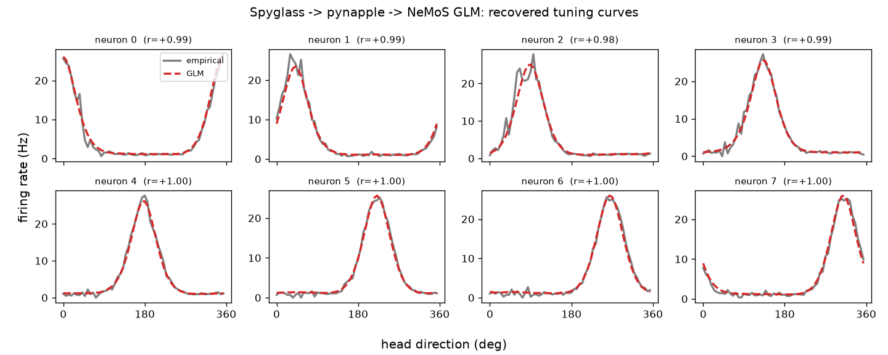

# Spyglass → NeMoS: integrating two neural-analysis packages

A small, **runnable** demo showing that data managed by
[Spyglass](https://github.com/LorenFrankLab/spyglass) (Loren Frank Lab;
[eLife reviewed preprint](https://elifesciences.org/reviewed-preprints/108089))
can be fed directly into [NeMoS](https://github.com/flatironinstitute/nemos)
(Flatiron Institute) to fit a GLM of neural firing.



> A population GLM fit through this pipeline recovers each neuron's
> head-direction tuning (dashed red) almost exactly from the empirical curve
> (grey). Generate this figure yourself with `python integrated_pipeline.py --plot`.

## TL;DR — how easy is this?

**Easy by design.**

```
Spyglass  ──(NWB files on disk)──▶  pynapple  ──(TsGroup / Tsd / IntervalSet)──▶  NeMoS
```

- **Spyglass** stores every analysis result as an **NWB** file and ships a
  one-line bridge: `(Table & key).fetch_pynapple()`. Its implementation is
  literally `[pynapple.load_file(path) for path in analysis_nwb_files]` — it
  hands you **pynapple** objects.
- **NeMoS** consumes pynapple objects **natively**. Its basis and GLM classes
  accept a `TsGroup` of spike times, a `Tsd`/`TsdFrame` covariate, and an
  `IntervalSet` of valid epochs — exactly what falls out of Spyglass.

So the integration code is trivial: pull pynapple objects from Spyglass, bin
them, build features with a NeMoS basis, fit a GLM. **The entire seam between
the two ecosystems is a single function that returns `(units, feature, epoch)`.**

### The caveat (effort is in infrastructure, not glue code)

| Concern | Difficulty |
|---|---|
| Writing the bridge code | **Trivial** — pynapple is the shared currency; ~5 lines |
| Installing NeMoS + pynapple | **Easy** — `pip install`, one numpy/numba pin (see below) |
| Standing up Spyglass | **Heavy** — needs a running **DataJoint/MySQL** backend, configured NWB data store, and a populated pipeline. This is the only real friction, but Spyglass users have already done this step. |

Because the hard part is the database, this demo defines the seam **twice**,
returning *identical pynapple types* either way:

- `load_session_from_spyglass(...)` — the real call pattern against a live
  Spyglass/DataJoint DB (lazily imported, so the file runs without Spyglass).
- `make_synthetic_session(...)` — a self-contained simulator of
  head-direction cells, so the **downstream NeMoS pipeline is fully runnable**
  on any machine with just `pynapple` + `nemos`.

Everything after the seam (`fit_glm`, tuning recovery) is byte-for-byte
identical regardless of source — which is the whole point.

## What the demo does

Fits a population **Poisson GLM** predicting spike counts from head direction,
using a **cyclic B-spline basis** (appropriate for a circular covariate), then
recovers each neuron's tuning curve and checks it against the empirical one.

Verified output (synthetic mode):

```
McFadden pseudo-R^2 (population): 0.150
neuron 0: empirical-vs-GLM tuning corr = +0.990  [true pref     0 deg]
...
mean tuning correlation across neurons: +0.991
-> GLM recovered the cells' tuning. Pipeline works end to end.
```

## Run it

### With [uv](https://docs.astral.sh/uv/) (recommended)

The repo ships a `pyproject.toml`, so uv resolves and runs everything in one
step — no manual venv, no activation:

```bash
uv run integrated_pipeline.py            # synthetic data — always works
uv run integrated_pipeline.py --plot     # also save tuning_curves.png
uv run integrated_pipeline.py --spyglass # pull from a live Spyglass DB
```

The first run creates `.venv`, installs the pinned dependencies, and writes a
`uv.lock` for reproducible re-runs. uv also fetches a compatible Python 3.12
for you if you don't have one.

If you prefer an explicit environment:

```bash
uv venv --python 3.12
uv pip install -r requirements.txt
uv run python integrated_pipeline.py
```

### With pip

```bash
pip install -r requirements.txt
python integrated_pipeline.py
```

### Environment notes

- **Python 3.12.** `nemos>=0.2.9` requires Python `>=3.12`, while `numpy<2.0`
  (needed transitively by numba via pynapple) has no wheels for `>=3.13`. So
  3.12 is the one version that satisfies both; `pyproject.toml` pins this.
- **numpy < 2.0.** numba (a pynapple dependency) requires it. If you hit
  `ImportError: Numba needs NumPy 2.0 or less`, run `pip install "numpy<2.0"`.

Validated on: `python 3.12`, `numpy 1.26.4`, `pynapple 0.11.3`,
`nemos 0.2.9`, `pynwb 3.1.3`, `matplotlib 3.11`, via `uv 0.11`.

## The integration in one screen

```python
# --- Spyglass side: fetch_pynapple() returns pynapple NWBFile objects -------
nwb   = (SortedSpikesGroup & key).fetch_pynapple()[0]
units = nwb["units"]                 # pynapple TsGroup  (spike times)
feat  = pos_nwb["head_orientation"]  # pynapple Tsd      (covariate)
epoch = nap.IntervalSet(*valid_times.T)

# --- NeMoS side: pynapple objects go straight in ----------------------------
counts = units.count(0.01, epoch)                       # TsdFrame (T, N)
basis  = nmo.basis.CyclicBSplineEval(8)
X      = basis.compute_features(np.asarray(feat.bin_average(0.01, epoch)))
glm    = nmo.glm.PopulationGLM().fit(X, counts)         # fit a GLM. done.
```

> Note the `np.asarray(...)` around the basis input. Current NeMoS (>= ~0.2.5)
> validates basis inputs with `.astype(float)` *before* its pynapple→array
> conversion, and modern pynapple time series have no `.astype`. Passing a numpy
> array sidesteps this on every version. `integrated_pipeline.py` wraps this in
> a one-line `basis_features()` helper that re-attaches the pynapple time index.

## Files

- `integrated_pipeline.py` — the demo (both data seams + shared NeMoS pipeline)
- `pyproject.toml` — project + dependencies (the `uv run` entry point)
- `requirements.txt` — same deps for the plain-pip flow
- `uv.lock` — fully pinned, reproducible resolution
- `docs/tuning_curves.png` — sample output figure
- `LICENSE` — MIT
